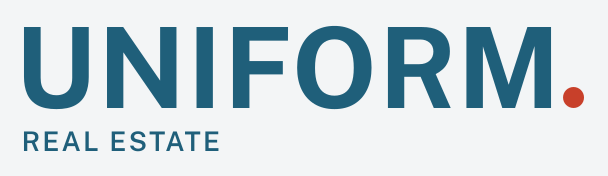

<p align="center">
  
</p>

# A shared visual foundation for real estate software

**Consistent interfaces, from the first public page to the last transaction document.**

Uniform Design brings brand tokens, CSS components, self-hosted typography, and the Atmosphere wave motif into one small, versioned package. Use the same foundation in a website, an application, or an HTML document destined for PDF.

[Get started](#get-started) · [Components](#components) · [Tokens and assets](#tokens-and-assets) · [Contribute](#contribute) · [Licensing](#licensing)

## Built to travel

- **HTML first.** Plain `u-*` CSS classes. No framework or component JavaScript required.
- **Shared brand values.** Tokens generate CSS variables, TypeScript constants, and Python constants.
- **Two themes.** Dark by default; light wherever you set `data-theme="light"`.
- **Self-hosted assets.** Fonts, logos, styles, and optional animation ship together. No runtime CDN requests.
- **CSP-conscious.** External CSS, with no inline styles or `data:` assets required for components.
- **Small dependency surface.** No runtime package dependencies; a Node build produces committed assets and a SHA-256 manifest.

### Status and scope

**Early foundation · v0.1.4.** This release supplies visual primitives and a component gallery. It is not yet a complete application UI framework or an accessibility certification. Pin a release and test it in your application before upgrading.

The direction is a shared foundation for more real estate experiences. Today, routing, authentication, data handling, interactive widget behavior, and regulatory requirements belong to the consuming application. Dialogs, comboboxes, date pickers, and other complex controls are not supplied.

## Get started

### 1. Install a pinned release

```sh
npm install --save-exact github:UniformRealEstate/design#v0.1.4
```

The package name is `@uniform/design`. Installation currently uses GitHub. The package declares Node 24 or newer; repository development uses the version in [`.nvmrc`](.nvmrc).

### 2. Serve the assets

Copy the **contents** of `node_modules/@uniform/design/dist/` into your application's static directory. For an application serving `public/` at its root:

```sh
mkdir -p public/design
cp -R node_modules/@uniform/design/dist/. public/design/
```

Keep the directory structure intact: CSS references fonts through relative paths. Link the stylesheet:

```html
<link rel="stylesheet" href="/design/design.css" />
```

### 3. Compose with semantic HTML

```html
<body class="u-root" data-theme="light">
  <main class="u-panel">
    <h1 class="u-title">Your workspace<span class="u-dot" aria-hidden="true"></span></h1>
    <p class="u-lede">A clear place to begin.</p>
    <a class="u-button" href="/records">View records</a>
  </main>
</body>
```

Omit `data-theme="light"` for dark mode. Theme attributes can also be applied to individual sections. Styles define root-level theme variables and `color-scheme`; evaluate those global defaults when embedding the kit in an existing application.

Use native elements for their behavior: anchors for navigation, buttons for actions, and labels associated with form controls. CSS supplies presentation; your markup and application supply semantics and behavior.

## Components

| Need                         | Classes                                                                                                                            |
| ---------------------------- | ---------------------------------------------------------------------------------------------------------------------------------- |
| Typography                   | `u-title`, `u-heading`, `u-eyebrow`, `u-lede`, `u-meta`, `u-code`                                                                  |
| Surfaces and messages        | `u-panel`, `u-panel--accent`, `u-callout`, `u-callout--danger`, `u-empty`                                                          |
| Actions                      | `u-button`, `u-button--quiet`                                                                                                      |
| Forms                        | `u-field`, `u-select`, `u-hint`                                                                                                    |
| Structured information       | `u-facts`, `u-facts--stacked`, `u-table` (scrolls on narrow screens: give the wrapper `tabindex="0" role="region" aria-label="…"`) |
| Status and progress          | `u-tag`, `u-tag--ok`, `u-tag--warn`, `u-check`, `u-progress`                                                                       |
| Navigation and accessibility | `u-nav`, `u-skip`, `u-sr`                                                                                                          |
| Brand details                | `u-dot`, `u-atmosphere`                                                                                                            |

[The gallery](gallery/index.html) contains working component markup, with dark and light examples. Clone the repository and open `gallery/index.html` to inspect the static components. Serve the repository through a local HTTP server to run the optional animation module as well.

For a labeled field with help text:

```html
<div class="u-field">
  <label for="record-title">Record title</label>
  <input id="record-title" name="title" type="text" aria-describedby="title-hint" />
  <span class="u-hint" id="title-hint">Use a short, descriptive title.</span>
</div>
```

Provide application-specific validation, error announcements, loading states, and disabled behavior. The kit does not yet define a complete state system for every control.

## Tokens and assets

| Entry                        | Use                                                                          |
| ---------------------------- | ---------------------------------------------------------------------------- |
| `@uniform/design/design.css` | Tokens, font faces, and components together                                  |
| `@uniform/design/tokens.css` | Brand variables and font faces                                               |
| `@uniform/design/vars.css`   | Brand variables only, for applications managing their own fonts              |
| `dist/tokens.js` + `.d.ts`   | `import { tokens } from "@uniform/design/tokens"`: plain JS with exact types |
| `dist/tokens.py`             | Constants for Python consumers                                               |
| `@uniform/design/waves`      | Contour math, SVG generation, and browser animation                          |
| `dist/svg/`, `dist/fonts/`   | Brand marks and self-hosted fonts; separate licenses apply                   |
| `dist/manifest.json`         | SHA-256 hashes for generated files                                           |

The `@uniform/design/tokens` export currently points to TypeScript source. It is **not a portable plain-Node runtime import** from `node_modules`. Use CSS variables, a TypeScript-capable bundler, or the generated Python file as appropriate.

For your own components, use semantic variables from `design.css`, plus spacing and radius tokens:

```css
.record-card {
  background: var(--u-surface);
  color: var(--u-fg);
  padding: var(--u-space-5);
  border-radius: var(--u-radius-lg);
}
```

Python and other non-Node projects can obtain `dist/` from a pinned Git tag. Verify downloaded files against its manifest. The manifest detects mismatched files; establish trust in the release separately. Preserve the accompanying code, brand, and font license files when redistributing assets.

## Atmosphere

The optional wave motif shares one implementation between animated canvas and static SVG output. For a server-rendered page:

```html
<canvas id="atmosphere" class="u-atmosphere" aria-hidden="true"></canvas>
<script type="module" src="/design/atmosphere.js"></script>
```

For application-controlled mounting:

```js
import { mountAtmosphere } from "@uniform/design/waves";

const dispose = mountAtmosphere(document.querySelector("#atmosphere"));
// Call dispose() when the owning view unmounts.
```

The canvas uses viewport dimensions. Animation pauses for reduced-motion preferences and hidden documents; cleanup removes listeners and its animation frame. Keep decorative canvas hidden from assistive technology and check its stacking order in your layout.

`contours(width, height, time, options)` returns polylines; `contoursSvg(width, height, options)` returns SVG text. See [the API types](atmosphere/waves.d.ts). These helpers currently expect trusted, valid inputs: finite positive dimensions and step values, bounded strand counts, and trusted color constants. Do not pass user-controlled strings into SVG generation or insert untrusted SVG into a page.

## Quality and accessibility

Current CI checks formatting, exact agreement between sources and committed `dist/`, AA text contrast for explicitly listed token pairs, the brand-asset allowlist, a limited credential-pattern scan, and GitHub Actions workflow security linting.

These checks are a baseline. They do not yet cover every rendered component state, keyboard interaction, screen reader behavior, responsive layout, or browser. Test actual pages in both themes, including focus, errors, zoom, and reduced motion. Verify CSP compatibility against the consuming application's policy.

## Contribute

Read [AGENTS.md](AGENTS.md) for repository rules. Keep changes focused on reusable design assets and behavior, with placeholder data in examples.

```sh
nvm use
npm ci
npm run build
npm run check
```

1. Edit source files, not generated `dist/` files.
2. Change brand values in `tokens/tokens.json`; register new text/background combinations in `contrast.pairs`.
3. Add brand files to `brand/assets.txt` when applicable.
4. Rebuild and commit `dist/` alongside the source change.
5. Inspect the gallery in both themes and verify affected consuming applications.

```text
tokens/        Brand values and declared contrast pairs
components/    Framework-independent CSS
atmosphere/    Shared wave implementation and types
brand/         Marks, fonts, and font licenses
build/         Deterministic asset generation
scripts/       Repository checks
gallery/       Component examples
dist/          Committed release assets
```

Releases use `vX.Y.Z` Git tags. Consumers upgrade explicitly by updating their pinned dependency and lockfile. During `0.x`, review changes and validate integrations before adopting a new release.

## Licensing

**Code is reusable; Uniform's identity is reserved.**

- Code: [Apache-2.0](LICENSE), with attribution details in [NOTICE](NOTICE).
- Uniform names, logos, wordmarks, and icons: [all rights reserved](LICENSE-BRAND). Publishing assets does not grant permission to brand another product as Uniform.
- Fonts: SIL Open Font License; see [Public Sans](brand/fonts/OFL-PublicSans.txt) and [IBM Plex Mono](brand/fonts/OFL-IBMPlexMono.txt).

If you use the code for a different brand, supply your own identity assets and tokens. Consult the repository's license files; the current package's file list does not include every root-level notice.
